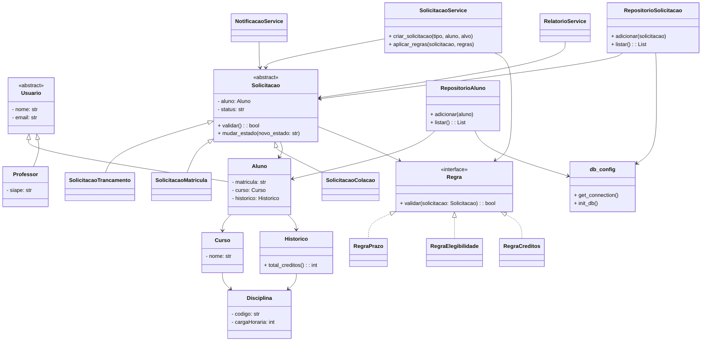

# Sistema de Gestão de Solicitações Acadêmicas (SGSA)

Sistema orientado a objetos para o gerenciamento de solicitações acadêmicas em instituições de ensino superior.  
O SGSA modela o ciclo de vida de solicitações realizadas por alunos, considerando diferentes tipos de pedidos, regras acadêmicas e estados de processamento, com foco em **extensibilidade, clareza de domínio e boas práticas de Programação Orientada a Objetos**.

---

## 🎯 Visão Geral

Este projeto aplica, de forma prática, os principais conceitos de **Programação Orientada a Objetos (POO)** no desenvolvimento de um sistema acadêmico realista.  
A solução demonstra:
- Abstração, herança e polimorfismo  
- Encapsulamento e composição  
- Princípios **SOLID**  
- Padrões de projeto (Strategy, Factory, Observer, State)  
- Arquitetura em camadas (domínio / aplicação / infraestrutura)  

---

## 📚 Domínio do Sistema

O sistema gerencia **solicitações acadêmicas** realizadas por alunos.  
Cada solicitação:
- É iniciada por um aluno  
- Pertence a um tipo específico (Trancamento, Matrícula, Colação de Grau)  
- Possui um estado (Aberta, Em análise, Finalizada)  
- Está associada a regras acadêmicas (prazo, elegibilidade, créditos)  
- É analisada por um setor acadêmico responsável  

---

## 🏗️ Arquitetura


---

## Diagrama UML de Classes


## Estrutura de código
```
Sistema-SGSA/
│
├── domain/                
│   ├── usuario.py                # Classe abstrata Usuario, subclasses Aluno e Professor
│   ├── aluno.py                  # Classe Aluno (separada de usuario.py, se preferir)
│   ├── professor.py              # Classe Professor
│   ├── curso.py                  # Classe Curso
│   ├── disciplina.py             # Classe Disciplina
│   ├── historico.py              # Classe Historico (disciplinas concluídas, créditos)
│   ├── setor.py                  # Classe Setor (se aplicável)
│   ├── estado.py                 # Classe Estado (status de solicitações)
│   ├── solicitacao.py            # Classe base abstrata Solicitação
│   ├── solicitacao_trancamento.py# Solicitação de trancamento
│   ├── solicitacao_matricula.py  # Solicitação de matrícula
│   ├── solicitacao_colacao.py    # Solicitação de colação de grau
│
├── rules/                     
│   ├── regra_base.py             # Interface Regra
│   ├── regra_prazo.py            # Implementação da regra de prazo
│   ├── regra_elegibilidade.py    # Implementação da regra de elegibilidade
│   ├── regra_creditos.py         # Implementação da regra de créditos mínimos
│
├── application/               
│   ├── solicitacao_service.py    # Factory de solicitações + aplicação de regras
│   ├── notificacao_service.py    # Observer para notificações
│   ├── relatorio_service.py      # Relatórios simples
│
├── infrastructure/            
│   ├── repositorio_aluno.py      # CRUD de alunos
│   ├── repositorio_solicitacao.py# CRUD de solicitações
│   ├── repositorio_disciplina.py # CRUD de disciplinas (novo)
│   ├── db_config.py              # Configuração do banco SQLite (criação de tabelas)
│
├── tests/                        # Pasta reservada para testes unitários
│
└──main.py                       # CLI interativo com menu
```

- **Domain**: Aluno, Professor, Curso, Disciplina, Solicitação, Regras  
- **Application**: Serviços de solicitação e notificação  
- **Infrastructure**: Repositórios e integração com banco de dados  
- **Tests**: Suíte de testes automatizados (mínimo 12)  

---

## 🧩 Hierarquias

- **Usuário**: `Usuario` (abstrata) → `Aluno`, `Professor`  
- **Solicitação**: `Solicitacao` (abstrata) → `Trancamento`, `Matrícula`, `Colação de Grau`  

---

## 🌀 Padrões de Projeto

- **Strategy**: regras acadêmicas (prazo, elegibilidade, créditos)  
- **Factory**: criação de solicitações  
- **Observer**: notificação de setores responsáveis  
- **State**: ciclo de vida da solicitação  

---

## 🧱 Princípios SOLID

- **SRP**: cada classe tem responsabilidade única  
- **OCP**: novas regras podem ser adicionadas sem modificar código existente  
- **LSP**: subclasses de Solicitação respeitam contrato da classe abstrata  
- **DIP**: serviços dependem de abstrações, não de implementações concretas  

---

## Integrantes do Grupo

| Nome Completo                     | GitHub |
|----------------------------------|--------|
| Carlos Eduardo Bezerra Santos    | https://github.com/carlossan25c |
| Raimundo Sebastiao Pereira Neto  | https://github.com/Raimundo06 |
| Lucas Daniel Dias de Sousa       | https://github.com/Lucasd11 |
| Davi Maia Soares                 | https://github.com/davimso |
| José Luiz de Lima Mendes         | https://github.com/J-Luiz-L |

O Gemini disse
Com base nos arquivos fornecidos, realizei a documentação completa. Abaixo, apresento primeiro a expansão do seu README.md com as seções de instalação e uso, e em seguida, as versões comentadas de cada arquivo de código.

📄 Expansão do README.md
Adicione as seguintes seções ao final do seu arquivo README.md atual:

🛠️ Instalação e Configuração
Pré-requisitos
Python 3.8+ instalado.

SQLite3 (já vem nativo com o Python).

Passo a Passo
Clone o repositório:

Bash
git clone https://github.com/seu-usuario/SGSA.git
cd SGSA
Inicialize o Banco de Dados:
O sistema utiliza SQLite. Antes da primeira execução, certifique-se de que a função init_db() do arquivo infrastructure/db_config.py seja chamada para criar as tabelas sgsa.db.

🚀 Como Executar
Para iniciar o sistema via CLI (Interface de Linha de Comando), execute o arquivo principal:

Bash
python main.py
💡 Exemplos de Uso (Snippet de Código)
Abaixo, um exemplo de como o sistema pode ser utilizado programaticamente:

Python
from infrastructure.db_config import init_db
from application.solicitacao_service import SolicitacaoService
from domain.aluno import Aluno
from domain.curso import Curso

# 1. Inicializa o banco
init_db()

# 2. Instancia objetos de domínio
curso_si = Curso("Sistemas de Informação")
aluno = Aluno("João Silva", "joao@email.com", "2023001", curso_si)

# 3. Usa o serviço para criar uma solicitação (Pattern: Factory)
service = SolicitacaoService()
solicitacao = service.criar_solicitacao("trancamento", aluno, curso_si)

print(f"Solicitação de {solicitacao.__class__.__name__} criada com sucesso!")