# Sistema de Gestão de Solicitações Acadêmicas (SGSA)

Sistema orientado a objetos para o gerenciamento de solicitações acadêmicas em instituições de ensino superior.  
O SGSA modela o ciclo de vida de solicitações realizadas por alunos, considerando diferentes tipos de pedidos, regras acadêmicas e estados de processamento, com foco em **extensibilidade, clareza de domínio e boas práticas de Programação Orientada a Objetos**.

---

## 🎯 Visão Geral

Este projeto aplica, de forma prática, os principais conceitos de **Programação Orientada a Objetos (POO)** no desenvolvimento de um sistema acadêmico realista.  
A solução demonstra:
- Abstração, herança e polimorfismo
- Encapsulamento e composição
- Princípios **SOLID**
- Padrões de projeto (Strategy, Factory, Observer, State)
- Arquitetura em camadas (domínio / aplicação / infraestrutura)

---

## 📚 Domínio do Sistema

O sistema gerencia **solicitações acadêmicas** realizadas por alunos.  
Cada solicitação:
- É iniciada por um aluno
- Pertence a um tipo específico (Trancamento, Matrícula, Colação de Grau)
- Possui um estado (Aberta, Em Análise, Aprovada, Rejeitada, Cancelada)
- Está associada a regras acadêmicas validadas automaticamente
- É analisada por um setor acadêmico responsável

---

## 🏗️ Arquitetura

O sistema segue uma **arquitetura em camadas**, onde cada camada tem responsabilidade exclusiva e se comunica apenas com a camada imediatamente abaixo:

```
CLI (main.py)
    ↓
Application  →  SolicitacaoService, NotificacaoService, RelatorioService
    ↓
Domain       →  Aluno, Curso, Disciplina, Solicitacao, Regras, Estados
    ↓
Infrastructure → Repositórios + db_config.py (persistência em JSON)
```

---

## Diagrama UML de Classes

```mermaid
classDiagram
    %% =========================
    %% Usuários
    %% =========================
    class Usuario {
        <<abstract>>
        - nome: str
        - email: str
    }
    class Aluno {
        - matricula: str
        - curso: Curso
        - historico: Historico
        - pendencias: list
    }
    class Professor {
        - siape: str
    }
    Usuario <|-- Aluno
    Usuario <|-- Professor

    %% =========================
    %% Domínio Acadêmico
    %% =========================
    class Curso {
        - nome: str
        - limite_horas_semestrais: int
        - min_horas_optativas: int
    }
    class Disciplina {
        - nome: str
        - carga_horaria: int
        - obrigatoria: bool
        - pre_requisitos: list
        - co_requisitos: list
    }
    class Historico {
        + foi_aprovado(disciplina): bool
        + total_creditos(): int
        + trancamentos: int
        + status_vinculo: str
    }
    Aluno --> Curso
    Aluno --> Historico
    Curso --> Disciplina
    Historico --> Disciplina

    %% =========================
    %% Solicitações
    %% =========================
    class Solicitacao {
        - aluno: Aluno
        - status: str
        + avancar()
        + cancelar()
        + rejeitar()
        + registrar_observador(obs)
    }
    class SolicitacaoTrancamento {
        - data: date
        - prazo: date
    }
    class SolicitacaoMatricula {
        - disciplinas_co_req_solicitadas: list
    }
    class SolicitacaoColacao
    Solicitacao <|-- SolicitacaoTrancamento
    Solicitacao <|-- SolicitacaoMatricula
    Solicitacao <|-- SolicitacaoColacao
    Solicitacao --> Aluno

    %% =========================
    %% Regras (Strategy)
    %% =========================
    class Regra {
        <<interface>>
        + validar(solicitacao): bool
    }
    class RegraPreRequisito
    class RegraCoRequisito
    class RegraLimiteCargaHoraria
    class RegraPrazo
    class RegraLimiteTrancamentos
    class RegraVinculoAtivo
    class RegraElegibilidade
    class RegraPendenciaDocumentacao
    class RegraCreditos
    Regra <|.. RegraPreRequisito
    Regra <|.. RegraCoRequisito
    Regra <|.. RegraLimiteCargaHoraria
    Regra <|.. RegraPrazo
    Regra <|.. RegraLimiteTrancamentos
    Regra <|.. RegraVinculoAtivo
    Regra <|.. RegraElegibilidade
    Regra <|.. RegraPendenciaDocumentacao
    Regra <|.. RegraCreditos

    %% =========================
    %% Serviços
    %% =========================
    class SolicitacaoService {
        + criar_solicitacao(tipo, aluno, alvo)
        + aplicar_regras(solicitacao, regras)
        + processar(solicitacao, regras)
    }
    class NotificacaoService {
        + atualizar(solicitacao)
        + notificar_setor(solicitacao)
    }
    class RelatorioService {
        + gerar_relatorio(solicitacoes)
    }
    SolicitacaoService --> Solicitacao
    SolicitacaoService --> Regra
    NotificacaoService --> Solicitacao
    RelatorioService --> Solicitacao

    %% =========================
    %% Infraestrutura
    %% =========================
    class RepositorioAluno {
        + adicionar(aluno)
        + listar(): list
        + remover(matricula)
    }
    class RepositorioSolicitacao {
        + adicionar(solicitacao, tipo)
        + listar(): list
    }
    class RepositorioDisciplina {
        + adicionar(disciplina)
        + listar(): list
    }
    class db_config {
        + init_db()
        + load_db(): dict
        + save_db(data)
    }
    RepositorioAluno --> Aluno
    RepositorioSolicitacao --> Solicitacao
    RepositorioAluno --> db_config
    RepositorioSolicitacao --> db_config
    RepositorioDisciplina --> db_config
```



---

## 🗂️ Estrutura de Código

```
SGSA/
│
├── domain/
│   ├── usuario.py                 # Classe abstrata base para todos os usuários
│   ├── aluno.py                   # Classe Aluno com histórico e pendências
│   ├── professor.py               # Classe Professor com matrícula SIAPE
│   ├── curso.py                   # Classe Curso com limite semestral e optativas
│   ├── disciplina.py              # Classe Disciplina com pré e co-requisitos
│   ├── historico.py               # Histórico acadêmico: notas, créditos, vínculo
│   ├── setor.py                   # Setor acadêmico responsável pelas análises
│   ├── estado.py                  # Padrão State: Aberta, Em Análise, Finalizada, Cancelada
│   ├── excecoes.py                # Exceções personalizadas de domínio
│   ├── solicitacao.py             # Classe base com State + Observer integrados
│   ├── solicitacao_trancamento.py # Solicitação de trancamento (com data e prazo)
│   ├── solicitacao_matricula.py   # Solicitação de matrícula (com co-requisitos)
│   └── solicitacao_colacao.py     # Solicitação de colação de grau
│
├── rules/
│   ├── regra_base.py              # Interface abstrata Regra (Strategy)
│   ├── regra_pre_requisito.py     # Verifica aprovação nos pré-requisitos
│   ├── regra_co_requisito.py      # Verifica matrícula simultânea em co-requisitos
│   ├── regra_limite_carga_horaria.py # Verifica teto de horas semestrais
│   ├── regra_prazo.py             # Verifica prazo do calendário acadêmico
│   ├── regra_limite_trancamentos.py  # Verifica limite de trancamentos (máx. 4)
│   ├── regra_vinculo_ativo.py     # Verifica se o vínculo é Ativo
│   ├── regra_elegibilidade.py     # Verifica integralização curricular para colação
│   ├── regra_pendencia_documentacao.py # Verifica pendências de biblioteca/documentos
│   └── regra_creditos.py          # Verifica mínimo geral de créditos
│
├── application/
│   ├── solicitacao_service.py     # Factory + Strategy + Observer orquestrados
│   ├── notificacao_service.py     # Observer: notifica aluno e setor
│   └── relatorio_service.py       # Relatórios consolidados de solicitações
│
├── infrastructure/
│   ├── db_config.py               # Leitura e escrita do arquivo sgsa.json
│   ├── repositorio_aluno.py       # CRUD de alunos no JSON
│   ├── repositorio_disciplina.py  # CRUD de disciplinas no JSON
│   └── repositorio_solicitacao.py # CRUD de solicitações no JSON
│
├── tests/                         # Suíte de testes unitários
├── sgsa.json                      # Banco de dados do sistema (gerado automaticamente)
└── main.py                        # Ponto de entrada — CLI via argparse
```

---

## 🧩 Hierarquias

- **Usuário**: `Usuario` (abstrata) → `Aluno`, `Professor`
- **Solicitação**: `Solicitacao` → `SolicitacaoTrancamento`, `SolicitacaoMatricula`, `SolicitacaoColacao`
- **Estado**: `EstadoSolicitacao` (abstrata) → `EstadoAberta`, `EstadoEmAnalise`, `EstadoFinalizada`, `EstadoCancelada`
- **Regra**: `Regra` (abstrata) → 9 implementações concretas

---

## 🌀 Padrões de Projeto

- **Strategy**: regras acadêmicas encapsuladas em classes separadas — novas regras são adicionadas sem alterar o serviço
- **Factory**: `SolicitacaoService.criar_solicitacao()` instancia o subtipo correto com base numa string
- **Observer**: `NotificacaoService` registrado nas solicitações e notificado automaticamente a cada mudança de estado
- **State**: `EstadoAberta → EstadoEmAnalise → EstadoFinalizada/EstadoCancelada` com transições inválidas bloqueadas por exceção

---

## 🧱 Princípios SOLID

- **SRP**: cada classe tem uma única responsabilidade (ex: Historico só gerencia histórico, Regra só valida um critério)
- **OCP**: novas regras e novos tipos de solicitação são adicionados por extensão, sem modificar código existente
- **LSP**: todas as subclasses de Solicitacao e Regra respeitam o contrato da classe base
- **DIP**: serviços dependem das abstrações `Regra` e `NotificacaoService`, não das implementações concretas

---

## 📐 Regras de Negócio

### 1. Regras de Validação Acadêmica (Padrão Strategy)

Para cada tipo de solicitação, o sistema valida critérios específicos antes de permitir a criação ou o processamento. O padrão Strategy garante que novas regras possam ser criadas sem alterar o código existente (**OCP — Open/Closed Principle**).

#### A. Solicitação de Matrícula

**Regra de Pré-requisito** — `RegraPreRequisito`
O aluno só pode se matricular em uma disciplina se tiver cursado e sido aprovado em todos os pré-requisitos registrados no seu `Historico`. A aprovação é verificada pela nota mínima configurada (padrão: 5.0).

**Regra de Co-requisito** — `RegraCoRequisito`
Certas disciplinas exigem matrícula simultânea em outras (ex: Teoria de Física e seu Laboratório). O co-requisito pode ser satisfeito de duas formas: o aluno já foi aprovado anteriormente na disciplina, ou está se matriculando nas duas ao mesmo tempo.

**Limite de Carga Horária** — `RegraLimiteCargaHoraria`
O aluno não pode exceder o limite máximo de horas semestrais definido pelo `Curso`. A soma das horas já matriculadas no semestre com a carga da nova disciplina não pode ultrapassar esse teto.

---

#### B. Solicitação de Trancamento

**Regra de Prazo Acadêmico** — `RegraPrazo`
O trancamento de disciplina só é permitido dentro do período definido no calendário acadêmico. A data da solicitação é comparada com o prazo limite informado no ato da criação.

**Limite de Trancamentos** — `RegraLimiteTrancamentos`
Um aluno só pode trancar o curso um número limitado de vezes — por padrão, no máximo **4 semestres**. O contador é armazenado no `Historico` do aluno e incrementado a cada trancamento efetivado.

**Vínculo Ativo** — `RegraVinculoAtivo`
Não é permitido solicitar trancamento se o aluno já estiver com o status de vínculo `"Trancado"` (duplo trancamento) ou `"Egresso"` (aluno desligado ou já formado). Apenas o status `"Ativo"` autoriza o pedido.

---

#### C. Solicitação de Colação de Grau

**Integralização Curricular** — `RegraElegibilidade`
O aluno deve ter completado 100% das disciplinas obrigatórias do curso com aprovação. Além disso, se o curso exigir um mínimo de horas optativas ou de atividades complementares (`min_horas_optativas`), esse valor também deve ter sido atingido.

**Pendência de Documentação** — `RegraPendenciaDocumentacao`
A solicitação de colação é negada se o aluno possuir qualquer pendência aberta — como débitos na biblioteca ou documentos de registro civil incompletos. Todas as pendências devem ser resolvidas antes do pedido.

---

### 2. Regras de Fluxo e Estado (Padrão State)

O ciclo de vida de uma solicitação respeita transições lógicas definidas pelo padrão State. Uma solicitação não pode "pular" etapas nem retroceder.

**Fluxo permitido:**
```
Aberta → Em Análise → Aprovada (Finalizada)
                    ↘ Rejeitada (Finalizada)
Aberta → Cancelada
```

**Imutabilidade Pós-Finalização**
Uma solicitação no estado `Finalizada` (Aprovada ou Rejeitada) não pode retornar para `Em Análise` nem ser cancelada. Qualquer tentativa lança `TransicaoEstadoInvalidaError`.

**Cancelamento pelo Usuário**
O aluno só pode cancelar solicitações que ainda estejam no estado `Aberta`. Se a solicitação já estiver `Em Análise`, o cancelamento deve ser solicitado ao `SetorAcademico`. Tentar cancelar fora do estado `Aberta` lança `CancelamentoNaoPermitidoError`.

---

### 3. Regras de Notificação (Padrão Observer)

Sempre que houver mudança de estado, as partes interessadas são notificadas automaticamente pelo `NotificacaoService`, que atua como Observador registrado diretamente na solicitação.

**Notificação ao Setor**
Ao criar uma `SolicitacaoMatricula`, a Coordenação do Curso é notificada proativamente pelo `SolicitacaoService`, antes mesmo de qualquer mudança de estado.

**Notificação ao Aluno**
Sempre que o status de uma solicitação mudar (ex: de `"Aberta"` para `"Em Análise"`, ou de `"Em Análise"` para `"Aprovada"`), o sistema dispara automaticamente uma notificação ao aluno. Em produção, esse mecanismo deve ser integrado com um serviço real de e-mail ou SMS.

---

### 4. Implementação Técnica (SOLID)

**Abstração — interface `Regra`**
Todas as regras herdam da classe abstrata `Regra` (em `rules/regra_base.py`), que define o método obrigatório `validar(solicitacao)`. Isso garante um contrato único para todas as implementações.

**Polimorfismo — `SolicitacaoService.aplicar_regras()`**
O serviço recebe uma lista de objetos `Regra` e chama `validar()` em cada um de forma polimórfica. Ele não sabe qual regra está executando — apenas que todas respondem ao mesmo método. Novas regras são adicionadas sem alterar o serviço.

**Tratamento de Exceções**
Se uma regra for violada, o sistema lança `ViolacaoRegraAcademicaError` com uma mensagem clara e o nome da regra que falhou — em vez de retornar `False` silenciosamente. Isso garante que o motivo da negativa seja sempre explícito para o usuário.

```python
# Exemplo de mensagem gerada automaticamente:
# [Violação Acadêmica - RegraPreRequisito]
# Pré-requisito(s) não cumprido(s) para 'Cálculo II': Cálculo I.
```

---

## 💾 Persistência de Dados

O sistema utiliza um **arquivo JSON local** (`sgsa.json`) como banco de dados. Não há dependência de nenhum banco de dados relacional ou SQLite.

O arquivo é gerenciado pelo módulo `infrastructure/db_config.py` através de três funções:

| Função | O que faz |
|---|---|
| `init_db()` | Cria o `sgsa.json` com estrutura vazia se não existir |
| `load_db()` | Lê e retorna todos os dados do arquivo |
| `save_db(data)` | Sobrescreve o arquivo com os dados atualizados |

O arquivo gerado tem a seguinte estrutura:

```json
{
    "alunos": [],
    "disciplinas": [],
    "solicitacoes": []
}
```

---

## ⚙️ Instalação e Configuração

**Pré-requisitos:**
- Python 3.8 ou superior

**Passo a passo:**

```bash
# 1. Clone o repositório
git clone https://github.com/seu-usuario/SGSA.git
cd SGSA

# 2. Execute o sistema — o arquivo sgsa.json é criado automaticamente
python main.py
```

Não é necessário instalar dependências externas. O sistema usa apenas bibliotecas padrão do Python (`json`, `os`, `abc`, `datetime`, `argparse`).

---

## 🖥️ Como Usar — Guia de Comandos (CLI)

O sistema é operado pela linha de comando através do arquivo `main.py`. Os comandos estão divididos em três grupos: **aluno**, **disciplina** e **solicitacao**.

---

### 👤 Comandos de Aluno

#### Cadastrar um aluno
Registra um novo aluno no sistema com seus dados básicos.

```bash
python main.py aluno cadastrar --nome "João Silva" --email "joao@inst.edu.br" --mat "2023001" --curso "Sistemas de Informação"
```

| Argumento | Obrigatório | Descrição |
|---|---|---|
| `--nome` | ✅ | Nome completo do aluno |
| `--email` | ✅ | E-mail institucional |
| `--mat` | ✅ | Código de matrícula único |
| `--curso` | ✅ | Nome do curso de graduação |

**Saída esperada:**
```
✅ Aluno 'João Silva' guardado com sucesso!
```

---

#### Listar todos os alunos
Exibe todos os alunos cadastrados no sistema.

```bash
python main.py aluno listar
```

**Saída esperada:**
```
📋 Lista de Alunos:
  - João Silva | Mat: 2023001 | Curso: Sistemas de Informação
  - Maria Souza | Mat: 2023002 | Curso: Engenharia de Software
```

---

#### Remover um aluno
Remove um aluno do sistema pelo código de matrícula.

```bash
python main.py aluno remover --mat "2023001"
```

| Argumento | Obrigatório | Descrição |
|---|---|---|
| `--mat` | ✅ | Matrícula do aluno a ser removido |

**Saída esperada:**
```
✅ Aluno 2023001 removido.
```

---

### 📖 Comandos de Disciplina

#### Cadastrar uma disciplina
Registra uma nova disciplina com seu nome e carga horária.

```bash
python main.py disciplina cadastrar --nome "Cálculo I" --carga 72
```

| Argumento | Obrigatório | Descrição |
|---|---|---|
| `--nome` | ✅ | Nome oficial da disciplina |
| `--carga` | ✅ | Carga horária total em horas (número inteiro) |

**Saída esperada:**
```
✅ Disciplina 'Cálculo I' adicionada.
```

---

#### Listar todas as disciplinas
Exibe todas as disciplinas cadastradas.

```bash
python main.py disciplina listar
```

**Saída esperada:**
```
📚 Lista de Disciplinas:
  - Cálculo I (72h)
  - Programação Orientada a Objetos (60h)
```

---

### 📋 Comandos de Solicitação

As solicitações são validadas automaticamente pelas regras acadêmicas antes de serem registradas. Se alguma regra for violada, a solicitação é negada e uma mensagem clara é exibida.

#### Criar uma solicitação de matrícula
Solicita a matrícula do aluno em uma disciplina.  
Regras verificadas automaticamente: pré-requisitos, co-requisitos e limite de carga horária semestral.

```bash
python main.py solicitacao criar --tipo matricula --mat "2023001" --alvo "Cálculo II"
```

---

#### Criar uma solicitação de trancamento
Solicita o trancamento de uma disciplina.  
Regras verificadas automaticamente: prazo do calendário, limite de trancamentos (máx. 4) e vínculo ativo.

```bash
# Sem verificação de prazo (prazo assume a data de hoje)
python main.py solicitacao criar --tipo trancamento --mat "2023001" --alvo "Cálculo I"

# Com prazo do calendário acadêmico definido
python main.py solicitacao criar --tipo trancamento --mat "2023001" --alvo "Cálculo I" --prazo 2025-10-31
```

---

#### Criar uma solicitação de colação de grau
Solicita a colação de grau do aluno.  
Regras verificadas automaticamente: integralização de todas as disciplinas obrigatórias, mínimo de optativas e ausência de pendências documentais.

```bash
python main.py solicitacao criar --tipo colacao --mat "2023001" --alvo "Sistemas de Informação"
```

---

#### Argumentos do comando `criar`

| Argumento | Obrigatório | Descrição |
|---|---|---|
| `--tipo` | ✅ | Tipo da solicitação: `matricula`, `trancamento` ou `colacao` |
| `--mat` | ✅ | Matrícula do aluno solicitante |
| `--alvo` | ✅ | Nome da disciplina (matrícula/trancamento) ou do curso (colação) |
| `--prazo` | ❌ | Prazo do calendário acadêmico no formato `YYYY-MM-DD` (usado no trancamento) |

**Saída em caso de sucesso:**
```
✅ Solicitação de 'matricula' registrada e validada.
```

**Saída em caso de violação de regra:**
```
❌ [Violação Acadêmica - RegraPreRequisito] Pré-requisito(s) não cumprido(s) para 'Cálculo II': Cálculo I.
```

---

#### Listar todas as solicitações
Exibe todas as solicitações registradas no sistema.

```bash
python main.py solicitacao listar
```

**Saída esperada:**
```
📄 Lista de Solicitações:
  ID: 1 | Tipo: matricula | Aluno: 2023001 | Alvo: Cálculo II | Status: Aberta
  ID: 2 | Tipo: trancamento | Aluno: 2023002 | Alvo: Cálculo I | Status: Aberta
```

---

### 📌 Resumo Rápido de Todos os Comandos

```bash
# Alunos
python main.py aluno cadastrar --nome "Nome" --email "email" --mat "MAT" --curso "Curso"
python main.py aluno listar
python main.py aluno remover --mat "MAT"

# Disciplinas
python main.py disciplina cadastrar --nome "Nome" --carga 72
python main.py disciplina listar

# Solicitações
python main.py solicitacao criar --tipo matricula   --mat "MAT" --alvo "Disciplina"
python main.py solicitacao criar --tipo trancamento --mat "MAT" --alvo "Disciplina" [--prazo YYYY-MM-DD]
python main.py solicitacao criar --tipo colacao     --mat "MAT" --alvo "Curso"
python main.py solicitacao listar
```

---

## 🔄 Ciclo de Vida de uma Solicitação

```
[Criada] → Aberta → Em Análise → Aprovada (Finalizada)
                               ↘ Rejeitada (Finalizada)
              ↘ Cancelada (pelo aluno, apenas no estado Aberta)
```

- O aluno só pode **cancelar** enquanto a solicitação estiver `Aberta`
- Uma vez `Finalizada` (Aprovada ou Rejeitada), a solicitação é **imutável**
- Toda mudança de estado dispara uma **notificação automática** ao aluno

---

## 🔐 Regras Acadêmicas Implementadas

| Regra | Aplica-se a | O que verifica |
|---|---|---|
| `RegraPreRequisito` | Matrícula | Aprovação em todos os pré-requisitos da disciplina |
| `RegraCoRequisito` | Matrícula | Matrícula simultânea nos co-requisitos necessários |
| `RegraLimiteCargaHoraria` | Matrícula | Respeito ao teto de horas semestrais do curso |
| `RegraPrazo` | Trancamento | Solicitação dentro do prazo do calendário acadêmico |
| `RegraLimiteTrancamentos` | Trancamento | Máximo de 4 trancamentos por aluno |
| `RegraVinculoAtivo` | Trancamento | Vínculo do aluno deve ser `Ativo` (não `Trancado` ou `Egresso`) |
| `RegraElegibilidade` | Colação | 100% das obrigatórias + mínimo de optativas concluídos |
| `RegraPendenciaDocumentacao` | Colação | Ausência de débitos na biblioteca ou documentos pendentes |
| `RegraCreditos` | Qualquer | Mínimo geral de horas-crédito aprovadas (configurável) |

---

## Integrantes do Grupo

| Nome Completo                     | GitHub |
|----------------------------------|--------|
| Carlos Eduardo Bezerra Santos    | https://github.com/carlossan25c |
| Raimundo Sebastiao Pereira Neto  | https://github.com/Raimundo06 |
| Lucas Daniel Dias de Sousa       | https://github.com/Lucasd11 |
| Davi Maia Soares                 | https://github.com/davimso |
| José Luiz de Lima Mendes         | https://github.com/J-Luiz-L |
