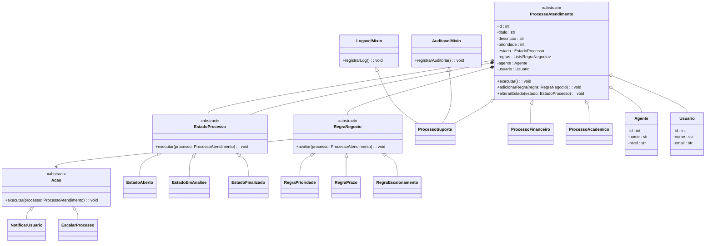

# Sistema-SGPAD-
Um sistema que modela processos de atendimento (ex.: suporte técnico, chamados, solicitações internas), onde o fluxo, as regras, as ações e os responsáveis variam dinamicamente conforme o tipo de processo, prioridade, estado e políticas configuradas.

## Diagrama UML de Classes

---

## Visão Geral do Projeto
Este projeto tem como objetivo o desenvolvimento de um sistema orientado a objetos para o gerenciamento de processos de atendimento, modelando fluxos de execução, regras de negócio e variações de comportamento de forma extensível, coesa e alinhada aos princípios da Programação Orientada a Objetos.

O sistema foi concebido para consolidar, de forma prática, os conceitos fundamentais e avançados de POO, incluindo abstração, herança, polimorfismo, encapsulamento, composição, agregação, princípios SOLID e padrões de projeto, conforme os requisitos estabelecidos na disciplina.

---

## Descrição Detalhada do Domínio
O domínio do sistema consiste no gerenciamento de processos de atendimento que representam solicitações realizadas por usuários e tratadas por agentes responsáveis. Cada processo percorre um fluxo próprio, sendo governado por regras de negócio que determinam seu comportamento ao longo do ciclo de vida.

Um processo de atendimento possui:
- um tipo específico (suporte, financeiro ou acadêmico);
- um estado atual, que influencia diretamente suas ações possíveis;
- um conjunto de regras de negócio aplicáveis;
- agentes responsáveis pelo atendimento;
- um usuário solicitante.

Os processos podem sofrer alterações de estado, disparar ações automáticas e aplicar regras distintas conforme seu tipo, prioridade e contexto de execução. O foco do sistema está no comportamento dos objetos e na interação entre eles, e não apenas no armazenamento de dados.

---

## Justificativa da Complexidade do Sistema
O sistema proposto apresenta complexidade superior a um simples CRUD, uma vez que incorpora múltiplos fluxos de execução e regras de negócio dinâmicas. O comportamento do sistema varia conforme o tipo do processo, o estado em que se encontra e as regras associadas, exigindo decisões em tempo de execução.

A utilização de Programação Orientada a Objetos é essencial para:
- reduzir o acoplamento entre componentes;
- permitir a extensão do sistema sem modificações estruturais;
- evitar estruturas condicionais extensas e de difícil manutenção;
- garantir clareza, reutilização e manutenibilidade do código.

Dessa forma, a complexidade do domínio justifica plenamente o uso de abstrações, herança, polimorfismo e composição.

---

