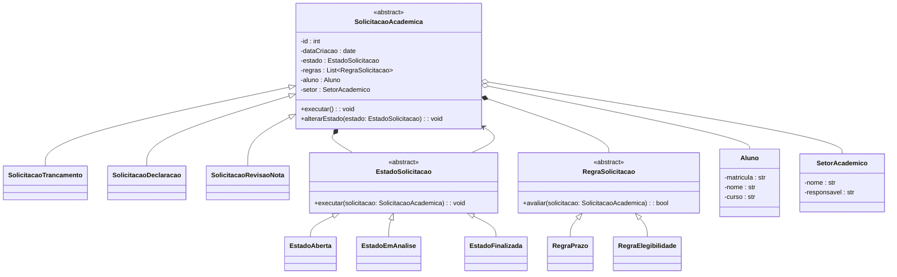

# Sistema de Gestão de Solicitações Acadêmicas (SGSA)

Sistema orientado a objetos para o gerenciamento de solicitações acadêmicas em instituições de ensino superior. O sistema modela o ciclo de vida de solicitações realizadas por alunos, considerando diferentes tipos de pedidos, regras acadêmicas e estados de processamento, com foco em extensibilidade, clareza de domínio e boas práticas de Programação Orientada a Objetos.

---

## Visão Geral do Projeto

Este projeto tem como objetivo aplicar, de forma prática, os principais conceitos da Programação Orientada a Objetos no desenvolvimento de um sistema de domínio acadêmico realista. A solução foi projetada para demonstrar abstração, herança, polimorfismo, encapsulamento, composição, agregação, princípios SOLID e padrões de projeto.

O sistema permite que alunos realizem solicitações acadêmicas que são analisadas por setores responsáveis, seguindo regras institucionais e percorrendo diferentes estados ao longo de seu ciclo de vida.

---

## Descrição Detalhada do Domínio

O domínio do sistema consiste no gerenciamento de solicitações acadêmicas realizadas por alunos de uma instituição de ensino superior. Essas solicitações representam processos formais que necessitam de análise e decisão por parte de setores acadêmicos específicos.

Cada solicitação acadêmica:
- é iniciada por um aluno;
- pertence a um tipo específico de solicitação;
- possui um estado atual que define seu comportamento;
- está associada a regras acadêmicas que determinam sua validade;
- é analisada por um setor acadêmico responsável.

As solicitações percorrem um fluxo bem definido, passando por estados como aberta, em análise e finalizada. O comportamento do sistema varia conforme o tipo de solicitação, o estado atual e as regras aplicadas.

---

## Justificativa da Complexidade do Sistema

O sistema proposto apresenta complexidade superior a aplicações simples baseadas em operações CRUD, pois envolve múltiplos fluxos de execução, regras acadêmicas e variação de comportamento em tempo de execução.

A complexidade do domínio justifica o uso da Programação Orientada a Objetos para:
- encapsular regras de negócio;
- reduzir acoplamento entre componentes;
- permitir a extensão do sistema sem modificações estruturais;
- evitar estruturas condicionais extensas e de difícil manutenção.

Dessa forma, abstração, herança, polimorfismo e composição tornam-se fundamentais para a correta modelagem do problema.

---

## Diagrama UML de Classes

O diagrama UML de classes a seguir representa a estrutura do sistema, destacando as hierarquias, associações, composições e agregações entre as entidades do domínio acadêmico.

## Integrantes do Grupo

| Nome Completo                     | GitHub |
|----------------------------------|--------|
| Carlos Eduardo Bezerra Santos    | https://github.com/carlossan25c |
| Raimundo Sebastiao Pereira Neto  | https://github.com/Raimundo06 |
| Lucas Daniel Dias de Sousa       | https://github.com/Lucasd11 |
| Davi Maia Soares                 | https://github.com/davimso |
| José Luiz de Lima Mendes         | https://github.com/J-Luiz-L |
