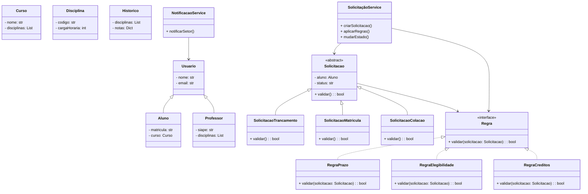

# Sistema de Gestão de Solicitações Acadêmicas (SGSA)

Sistema orientado a objetos para o gerenciamento de solicitações acadêmicas em instituições de ensino superior.  
O SGSA modela o ciclo de vida de solicitações realizadas por alunos, considerando diferentes tipos de pedidos, regras acadêmicas e estados de processamento, com foco em **extensibilidade, clareza de domínio e boas práticas de Programação Orientada a Objetos**.

---

## 🎯 Visão Geral

Este projeto aplica, de forma prática, os principais conceitos de **Programação Orientada a Objetos (POO)** no desenvolvimento de um sistema acadêmico realista.  
A solução demonstra:
- Abstração, herança e polimorfismo  
- Encapsulamento e composição  
- Princípios **SOLID**  
- Padrões de projeto (Strategy, Factory, Observer, State)  
- Arquitetura em camadas (domínio / aplicação / infraestrutura)  

---

## 📚 Domínio do Sistema

O sistema gerencia **solicitações acadêmicas** realizadas por alunos.  
Cada solicitação:
- É iniciada por um aluno  
- Pertence a um tipo específico (Trancamento, Matrícula, Colação de Grau)  
- Possui um estado (Aberta, Em análise, Finalizada)  
- Está associada a regras acadêmicas (prazo, elegibilidade, créditos)  
- É analisada por um setor acadêmico responsável  

---

## 🏗️ Arquitetura


---

## Diagrama UML de Classes


## Estrutura de código
```
Sistema-SGPAD/
│
├── domain/                # Entidades e regras de negócio
│   ├── aluno.py
│   ├── professor.py
│   ├── curso.py
│   ├── disciplina.py
│   ├── solicitacao.py     # Classe abstrata
│   ├── solicitacao_trancamento.py
│   ├── solicitacao_matricula.py
│   ├── solicitacao_colacao.py
│   ├── historico.py
│   └── regras/            # Estratégias de validação
│       ├── regra_base.py
│       ├── regra_prazo.py
│       ├── regra_elegibilidade.py
│       └── regra_creditos.py
│
├── application/           # Serviços e casos de uso
│   ├── solicitacao_service.py
│   ├── notificacao_service.py
│   └── relatorio_service.py
│
├── infrastructure/        # Persistência e integração
│   ├── repositorio_aluno.py
│   ├── repositorio_solicitacao.py
│   └── db_config.py
│
├── tests/                 # Testes automatizados
│   ├── test_aluno.py
│   ├── test_solicitacao.py
│   ├── test_regras.py
│   └── test_services.py
│
├── main.py                # Ponto de entrada
└── README.md              # Documentação

```

- **Domain**: Aluno, Professor, Curso, Disciplina, Solicitação, Regras  
- **Application**: Serviços de solicitação e notificação  
- **Infrastructure**: Repositórios e integração com banco de dados  
- **Tests**: Suíte de testes automatizados (mínimo 12)  

---

## 🧩 Hierarquias

- **Usuário**: `Usuario` (abstrata) → `Aluno`, `Professor`  
- **Solicitação**: `Solicitacao` (abstrata) → `Trancamento`, `Matrícula`, `Colação de Grau`  

---

## 🌀 Padrões de Projeto

- **Strategy**: regras acadêmicas (prazo, elegibilidade, créditos)  
- **Factory**: criação de solicitações  
- **Observer**: notificação de setores responsáveis  
- **State**: ciclo de vida da solicitação  

---

## 🧱 Princípios SOLID

- **SRP**: cada classe tem responsabilidade única  
- **OCP**: novas regras podem ser adicionadas sem modificar código existente  
- **LSP**: subclasses de Solicitação respeitam contrato da classe abstrata  
- **DIP**: serviços dependem de abstrações, não de implementações concretas  

---

## Integrantes do Grupo

| Nome Completo                     | GitHub |
|----------------------------------|--------|
| Carlos Eduardo Bezerra Santos    | https://github.com/carlossan25c |
| Raimundo Sebastiao Pereira Neto  | https://github.com/Raimundo06 |
| Lucas Daniel Dias de Sousa       | https://github.com/Lucasd11 |
| Davi Maia Soares                 | https://github.com/davimso |
| José Luiz de Lima Mendes         | https://github.com/J-Luiz-L |
