# Sistema de Gestão de Solicitações Acadêmicas (SGSA)

Sistema orientado a objetos para o gerenciamento de solicitações acadêmicas em instituições de ensino superior.  
O SGSA modela o ciclo de vida de solicitações realizadas por alunos, considerando diferentes tipos de pedidos, regras acadêmicas e estados de processamento, com foco em **extensibilidade, clareza de domínio e boas práticas de Programação Orientada a Objetos**.

---

## 🎯 Visão Geral

Este projeto aplica, de forma prática, os principais conceitos de **Programação Orientada a Objetos (POO)** no desenvolvimento de um sistema acadêmico realista.  
A solução demonstra:
- Abstração, herança e polimorfismo  
- Encapsulamento e composição  
- Princípios **SOLID**  
- Padrões de projeto (Strategy, Factory, Observer, State)  
- Arquitetura em camadas (domínio / aplicação / infraestrutura)  

---

## 📚 Domínio do Sistema

O sistema gerencia **solicitações acadêmicas** realizadas por alunos.  
Cada solicitação:
- É iniciada por um aluno  
- Pertence a um tipo específico (Trancamento, Matrícula, Colação de Grau)  
- Possui um estado (Aberta, Em análise, Finalizada)  
- Está associada a regras acadêmicas (prazo, elegibilidade, créditos)  
- É analisada por um setor acadêmico responsável  

---

## 🏗️ Arquitetura


---

## Diagrama UML de Classes

```mermaid
classDiagram
    %% =========================
    %% Usuários
    %% =========================
    class Usuario {
        <<abstract>>
        - nome: str
        - email: str
    }
    class Aluno {
        - matricula: str
        - curso: Curso
        - historico: Historico
    }
    class Professor {
        - siape: str
        - disciplinas: List<Disciplina>
    }
    Usuario <|-- Aluno
    Usuario <|-- Professor

    %% =========================
    %% Domínio Acadêmico
    %% =========================
    class Curso {
        - nome: str
        - disciplinas: List<Disciplina>
    }
    class Disciplina {
        - codigo: str
        - cargaHoraria: int
    }
    class Historico {
        - disciplinas: Dict<Disciplina, float>
        + total_creditos(): int
    }

    Aluno --> Curso
    Aluno --> Historico
    Curso --> Disciplina
    Historico --> Disciplina

    %% =========================
    %% Solicitações
    %% =========================
    class Solicitacao {
        <<abstract>>
        - aluno: Aluno
        - status: str
        + validar(): bool
        + mudar_estado(novo_estado: str)
    }
    class SolicitacaoTrancamento {
        - disciplina: Disciplina
    }
    class SolicitacaoMatricula {
        - disciplina: Disciplina
    }
    class SolicitacaoColacao {
        - curso: Curso
    }
    Solicitacao <|-- SolicitacaoTrancamento
    Solicitacao <|-- SolicitacaoMatricula
    Solicitacao <|-- SolicitacaoColacao

    %% =========================
    %% Regras (Strategy)
    %% =========================
    class Regra {
        <<interface>>
        + validar(solicitacao: Solicitacao): bool
    }
    class RegraPrazo
    class RegraElegibilidade
    class RegraCreditos
    Regra <|.. RegraPrazo
    Regra <|.. RegraElegibilidade
    Regra <|.. RegraCreditos
    Solicitacao --> Regra

    %% =========================
    %% Serviços
    %% =========================
    class SolicitacaoService {
        + criar_solicitacao(tipo, aluno, alvo)
        + aplicar_regras(solicitacao, regras)
    }
    class NotificacaoService {
        + notificar_setor(solicitacao)
    }
    class RelatorioService {
        + gerar_relatorio(solicitacoes)
    }
    SolicitacaoService --> Solicitacao
    SolicitacaoService --> Regra
    NotificacaoService --> Usuario
    RelatorioService --> Solicitacao

    %% =========================
    %% Infraestrutura
    %% =========================
    class RepositorioAluno {
        + adicionar(aluno)
        + listar(): List<Aluno>
    }
    class RepositorioSolicitacao {
        + adicionar(solicitacao)
        + listar(): List<Solicitacao>
    }
    class db_config {
        DATABASE: Dict
    }

```


## Estrutura de código
```
Sistema-SGSA/
│
├── domain/                
│   ├── usuario.py              # Usuario (abstrata), Aluno, Professor
│   ├── curso.py                # Curso
│   ├── disciplina.py           # Disciplina
│   ├── historico.py            # Historico
│   ├── solicitacao.py          # Classe abstrata Solicitação
│   ├── solicitacao_trancamento.py
│   ├── solicitacao_matricula.py
│   ├── solicitacao_colacao.py
│
├── rules/                     
│   ├── regra_base.py           # Interface Regra
│   ├── regra_prazo.py          # Implementação
│   ├── regra_elegibilidade.py  # Implementação
│   ├── regra_creditos.py       # Implementação
│
├── application/               
│   ├── solicitacao_service.py  # Factory + aplicação de regras
│   ├── notificacao_service.py  # Observer
│   ├── relatorio_service.py    # Relatórios simples
│
├── infrastructure/            
│   ├── repositorio_aluno.py
│   ├── repositorio_solicitacao.py
│   ├── db_config.py
│
├── tests/                     # (já planejados, não incluídos aqui)
│
└── main.py                    # CLI simples

```

- **Domain**: Aluno, Professor, Curso, Disciplina, Solicitação, Regras  
- **Application**: Serviços de solicitação e notificação  
- **Infrastructure**: Repositórios e integração com banco de dados  
- **Tests**: Suíte de testes automatizados (mínimo 12)  

---

## 🧩 Hierarquias

- **Usuário**: `Usuario` (abstrata) → `Aluno`, `Professor`  
- **Solicitação**: `Solicitacao` (abstrata) → `Trancamento`, `Matrícula`, `Colação de Grau`  

---

## 🌀 Padrões de Projeto

- **Strategy**: regras acadêmicas (prazo, elegibilidade, créditos)  
- **Factory**: criação de solicitações  
- **Observer**: notificação de setores responsáveis  
- **State**: ciclo de vida da solicitação  

---

## 🧱 Princípios SOLID

- **SRP**: cada classe tem responsabilidade única  
- **OCP**: novas regras podem ser adicionadas sem modificar código existente  
- **LSP**: subclasses de Solicitação respeitam contrato da classe abstrata  
- **DIP**: serviços dependem de abstrações, não de implementações concretas  

---

## Integrantes do Grupo

| Nome Completo                     | GitHub |
|----------------------------------|--------|
| Carlos Eduardo Bezerra Santos    | https://github.com/carlossan25c |
| Raimundo Sebastiao Pereira Neto  | https://github.com/Raimundo06 |
| Lucas Daniel Dias de Sousa       | https://github.com/Lucasd11 |
| Davi Maia Soares                 | https://github.com/davimso |
| José Luiz de Lima Mendes         | https://github.com/J-Luiz-L |
